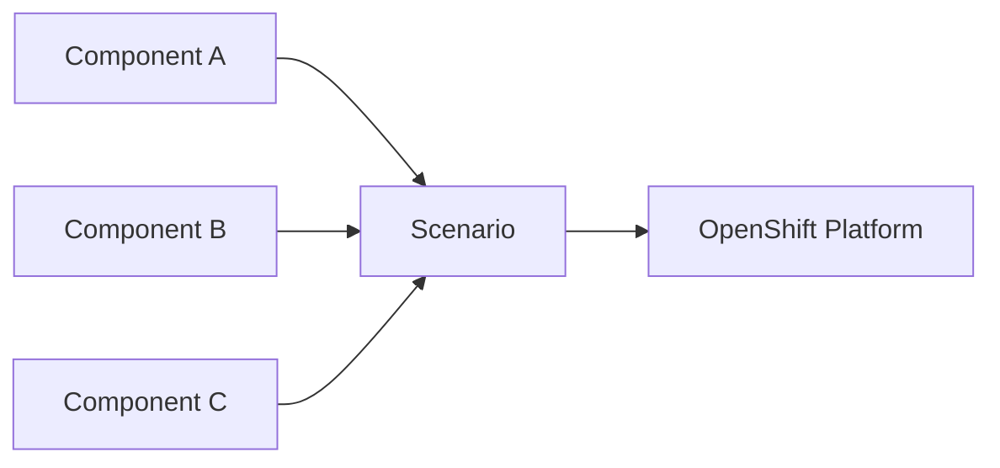

# OpenShift ShowTime

Welcome to **OpenShift ShowTime** — a library of OpenShift platform scenarios expressed as user stories, built from small, reusable **components**.

## What you will find here

- **Scenarios** — A narrative (the user story) plus a demo or example that shows the platform in action.
- **Components** — Single-purpose puzzle pieces (GitOps, identity, networking, observability, etc.) that combine into a scenario.
- **BYO** — A local-only area for credentials, vault material, and sealed secrets (never published).

## How it fits together

Each scenario declares which components it uses. Components may ship Ansible playbooks, shell automation, Kustomize overlays, or Helm charts.

## Next steps

- [Concepts overview](concepts/overview.md)
- [Components](concepts/components.md)
- [Scenarios](concepts/scenarios.md)
- [BYO (private material)](concepts/byo.md)
- [Project layout](project-layout.md)
